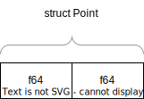
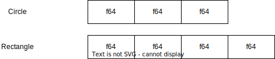
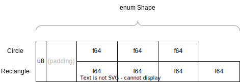

class: center
name: title
count: false

# LSRTM 2022-06

.p60[]

.me[.grey[*by* **Nicholas Matsakis**]]
.left[.citation[View slides at `https://nikomatsakis.github.io/lsrtm-2022-06/`]]

---

# Updates

We have a broadcast channel 🎉

https://broadcast.amazon.com/channels/44420

---

# Updates

Phonetool icon not here yet 🥲

---

# Updates

No Felienne today, she's busy with end of semester 🥲

Welcome Tim McNamarra, author of Rust in Action! 🎉

---

# Running meeting

* Join #learn-some-rust-this-month-interest
* Do not use Chime chat
* No jamboard: using slack channel instead
    * I will post a question
    * Post answer in the main channel, not in 🧵
    * Use slack 🧵 to respond to a specific person's comment

---

# CoC

* Going to be looking at your coworkers' code today, some of whom may be on this call.
* Be respectful, like in a code review
* Show, now tell

---

Today's topic...

# Enums, traits, and other tradeoffs

???

Both enums and traits let you deal with a case where you have values of different types and you need to work over them.

They work differently, and sometimes it's not obvious which one to use.

Plus, enums are less familiar to most people.

---

But before we get into that...

# Other Rust tradeoffs?

## What are times where Rust has asked you to make a decision that you find hard to make?

* Bonus points: bring receipts (link to the code)
* If you have examples of enums vs traits in particular, that’d be great!

---

# Enums vs traits (and especially trait objects)

Coming from Java, traits seem like interfaces, seem like the obvious choice.

In Rust, enums often work much better (but not always). 

Let's discuss. 💬

---

# Enums

Enums in many other languages

```rust
enum Color {
    Red,
    Green,
    Blue,
    Indigo,
    ...
}
```

---


---

# Enums in Rust

```rust
struct Point { x: f64, y: f64 }

enum Shape {
    Circle { center: Point, radius: f64 },
    Rectangle { upper_left: Point, width: f64, height: f64 }
}
```

---

# Matching on an enum

```rust
use std::f64::consts::PI;

fn compute_area(shape: &Shape) -> f64 {
    match shape {
        Circle { radius, .. } => PI * radius * radius,
        Sqare { width, height, .. } => width * height,
    }
}

fn other_code(shape: &Shape) {
    let area: f64 = compute_area(shape);
    ...
}
```

---

# Traits

A trait defines an interface...

```rust
trait Shape {
    fn compute_area(&self) -> f64;
}
```

---

# Implement traits for types

```rust
struct Circle { center: Point, radius: f64 }

impl Shape for Circle { ... }

struct Rectangle { upper_left: Point, width: f64, height: f64 }

impl Shape for Rectangle { ... }
```

---

# Able to work against "some shape"

```rust
fn other_code(shape: &dyn Shape) {
    let area: f64 = compute_area(shape);
    ...
}
```

Of course, you could also use generics `fn other_code<S: Shape>()`, but I'm focusing on `dyn` here.

---

# The fundamental tradeoff

| | Add more operations | Add more variants | 
| --- | --- | -- |
| **Enums** | 😎 | 😢  |
| **Traits** | 😢  | 😎 | 

---

# The fundamental tradeoff, recast

**Enums define the NOUNS everybody operates on:**

* There is a central enum definition that defines every state
* Easy to add a new verb that goes from state to state    
* Changing the interface requires modifying lots of functions

**Traits define the VERBS that people can use:**

* There is a central interface definition, but implements are scattered anywhere
* Easy to add a new implementation
* Changing the interface requires modifying lots of functions

---

# Which is better really depends

---

# Exposing NOUNS helps the borrow checker

The borrow checker works by ensuring that each active `&mut` points at distinct data. 

When you only expose verbs, it doesn't know what data is being used, and it must be conservative.

---

# Avoid: Low-level verbs

Here is a server trait....

```rust
trait Server {
    fn push_incoming_message(&mut self, m: Message);
    fn incoming_message_queue(&self) -> &[Message];

    fn push_outgoing_message(&mut self, m: Message) -> Message;
    fn outgoing_message_queue(&self) -> &[Message];
}
```

---

# But what happens here:

```rust
trait Server { ... }

fn replicate_incoming_messages(server: &mut dyn Server) {
    for message in server.incoming_message_queue() {
        server.push_outgoing_message(message.clone());
    }
}
```

[Playground](https://play.rust-lang.org/?version=stable&mode=debug&edition=2021&gist=2c9f11c58ef9ea31c47d63506403b491)

---

# But with structs?

```rust
struct Server {
    incoming_messages: Vec<Message>,
    outgoing_messages: Vec<Message>,
}

fn replicate_incoming_messages(server: &mut Server) {
    for message in &server.incoming_messages {
        server.outgoing_messages.push(message.clone());
    }
}
```

[Playground](https://play.rust-lang.org/?version=stable&mode=debug&edition=2021&gist=98f6bd379994a06df992bb50f4ded39c)

---

# What went wrong...?

Rust doesn't like *LOW-LEVEL VERBS*. Traits with a single method for each "major operation" work better:

```rust
trait Server  {
    fn enqueue_message(&mut self, m: Message);
    fn transfer_incoming_to_outgoing(&mut self);
    fn flush_messages(&mut self);
}
```

**If you can't easily define a trait like that because the set of things you want to do are so numerous and are defined all over your codebase, an enum may work better.**

---

# Gearing for reliability

```rust
enum ProtocolState {
    Initial,
    Connected(...),
    Final,
}
```

---

**What do you all think when you see this function?**

Answer in slack, no wrong answer.

```rust
enum ProtocolState {
    Initial,
    Connected(...),
    Final,
}

fn accepts_messages(ps: &ProtocolState) {
    match state {
        ProtocolState::Connected(..) => true,
        _ => false,
    }
}
```

--

**What I think whenever I see `_` in a match:**

What happens when I add a new variant?

---

# Say we add this...

```rust
enum ProtocolState {
    Initial,
    Connected(...),
    Terminating, // <-- new
    Final,
}

fn accepts_messages(ps: &ProtocolState) {
    match state {
        ProtocolState::Connected(..) => true,
        _ => false, // <-- still compiles -- but should this be false?
    }
}
```

.line4[]

--

.line11[]


---

# If I were reviewing...

```rust
enum ProtocolState {
    Initial,
    Connected(...),
    Final,
}

fn accepts_messages(ps: &ProtocolState) {
    match state {
        ProtocolState::Connected(..) => true,
        ProtocolState::Initial | ProtocolState::Final => false,
    }
}
```

.line10[]

---

# Memory layout of enums

```rust
struct Point { x: f64, y: f64 }

enum Shape {
    Circle { center: Point, radius: f64 },
    Rectangle { upper_left: Point, width: f64, height: f64 }
}
```

---

# Layout of a struct

```rust
struct Point(f64, f64);
```



---

# Layout of an enum variant

Each enum variant is a struct:

```rust
struct Circle { center: Point, radius: f64 }
struct Rectangle { upper_left: Point, width: f64, height: f64 }
```



[Let's check this out on the Rust playground](https://play.rust-lang.org/?version=stable&mode=debug&edition=2021&gist=5e9d83c41052e95f917da417c61b4a2f)

---

# Layout of an enum



---

# Balancing an enum variants

Sometimes you may want to use a `Box`

[playground](https://play.rust-lang.org/?version=stable&mode=debug&edition=2021&gist=085d869119f6625bcd327cd52de9c7ef)

---

# Enum sizing TL;DR

* An enum is as big as the largest variant plus (sometimes) memory for the discriminant
* `clippy::large_enum_variant` can help (though not in playground?)
* **But** there are important special cases where compiler can optimize:
    * e.g., `Option<Box<T>>` is same size as a `Box<T>`
    * see also [`std::num::NonZeroU32`](https://doc.rust-lang.org/std/num/struct.NonZeroU32.html)

---

# Traits let some code know the type

```rust
struct Circle { center: Point, radius: f64 }

trait Shape { }
impl Shape for Circle { .. }
```

Now I can pick:

* Some code has a `&Circle`, it knows the exact Shape
* Some code has a `&dyn Shape`, it does not

---

# Traits let some code know the type

```rust
fn example(
    circle: &Arc<Circle>,
    queue: &mut ShapeQueue,
) {
    queue.vec.push(circle.clone());

    let radius = circle.radius;
    ...
}

struct ShapeQueue {
    vec: Vec<Arc<dyn Shape>>
}
```

---

# Modeling dyn trait with enums

```rust
struct Circle { ... }
struct Rectangle { ... }

enum Shape { 
    Circle(Circle), Rectangle(Rectangle)
}

impl Shape {
    fn compute_area(&self) -> u64 {
        match self { ... }
    }
}
```

---

# Code sample #1

[Code sample](https://code.amazon.com/packages/NikoMat-LSRTM/blobs/93ffce65a000a0552fd558a383630b05347c5668/--/examples/2022-06-HealthCheck.rs)

---

In slack...

# Write two things you find interesting in this code

Doesn't have to be about traits.

Doesn't have to be two.

---

In slack...

# Why do you think `HealthCheck` is a trait, not an enum?

---

# Code sample #2

[Code sample](https://code.amazon.com/packages/NikoMat-LSRTM/blobs/93ffce65a000a0552fd558a383630b05347c5668/--/examples/2022-06-Ty.rs)

---

In slack...

**Write two things you find interesting in this code**

Doesn't have to be about traits.

Doesn't have to be two.

---

# Code sample #3

[Code sample](https://code.amazon.com/packages/NikoMat-LSRTM/blobs/93ffce65a000a0552fd558a383630b05347c5668/--/examples/2022-06-TaskControl.rs)

---

In slack...

**Write two things you find interesting in this code**

Doesn't have to be about traits.

Doesn't have to be two.

---

# Open floor

In slack...

**Any other thoughts?**

---

# Thank you

* Next meeting date not clear yet, due to vacations/summary, will announce
* **If you have some piece of code you think is interesting, send it to me!**
    * I'd like to focus this meeting more and more on walking through and discussing actual code
* Oh, as ever, please fill out [the survey!](https://survey.fieldsense.whs.amazon.dev/survey/85079979-00ec-4354-abf0-45fbbd1cd3e2)