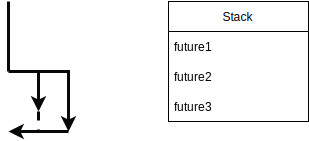

class: center
name: title
count: false

# LSRTM 2023-06

.p60[]

.left[.citation[View slides at `https://nikomatsakis.github.io/lsrtm/2023-06/`]]

---

# How to participate

.p50[
    
]

---

# How to participate

## Have a question?

* Do not use chime chat!
    * Start a 🧵 in slack channel `#learn-some-rust-this-month-interest`!
    * Better yet, come on video!

---

# How to participate

## Have a question?

## All questions are welcome

.p40[
    
]

---

# Pre-emptive thread scheduling

* Traditional Java method
* One O/S thread per connection (or piece of work you have to do)
    * operating system switches between them, ensuring fairness etc

---

# Cooperative thread scheduling

* Alternative:
    * small number of operating-system threads
    * user-space tasks managed by the application
* Having a moment:
    * Used by JavaScript, Go, Python async, Rust async, C# async (I think...?)
    * Java supports it via ForkJoinPool, futures, and upcoming "virtual threads" from Loom

---

# Pre-emptive vs Cooperative thread scheduling

* Why do people use cooperative?
    * Minimal resources per task
    * Switching between tasks does not require kernel
    * Application can tune scheduling to its needs
* *But...*
    * Kernel isn't managing things for you

---

name: terminology1 

# Terminology

* Thread
    * operating system unit of scheduling
* Task
    * user-space unit of work

Each *thread* runs multiple *tasks*.

---

# Tokio at an absurdly high level

```rust
fn scheduler_thread() {
    ...

    for task in &pool_of_tasks {
        match task.poll() {
            Poll::Ready(()) => /* remove task from pool of tasks */,
            Poll::Pending => (),
        }
    }

    ...
}
```

???

of course in reality not this naive

---

# How can this go wrong?

I'll give you a hint...

--


---

# How can this go wrong?

## STARVATION

```rust
async fn some_task() {
    loop {}
}
```

✋ What happens if scheduler loop calls this function?

(Answer in slack or come on chime)

---

# What about this?

```rust
async fn some_task(buffer: &[Packet]) {
    std::thread::sleep(500);
}
```

More common cause is *blocking*:

* sleep
* synchronous I/O

---

# Is this code a problem?

```rust
async fn some_task(buffer: &[Packet]) {
    for packet in buffer {
        process_packet(packet);
    }
}
```

--

It depends:

* How many packets?
* How much work is it to "process" one?

---

# Let's try it

[Demonstration](https://play.rust-lang.org/?version=stable&mode=debug&edition=2021&gist=cb3683b0be675229273367528630547b)

---

# How do you fix it?

* Option A: `tokio::task::yield_now().await`

This can be tricky. For example:

```rust
async fn some_task(buffer: &[Packet]) {
    for packet in buffer {
        process_packet(packet);
        tokio::task::yield_now().await;
    }
}
```

✋ Does this help?

--

👉 If `process_packet` is cheap, yes, else no.

---

# How do you fix it?

* Option A: `tokio::task::yield_now().await` (easy to do wrong)

--
* Option B: `tokio::task::spawn_blocking` (better place to start)

Starts a thread that will do the synchronous work. Pretty optimized.

[Let's try it!](https://play.rust-lang.org/?version=stable&mode=debug&edition=2021&gist=e32a58733542a111adcad27e101f7141)

---

# Tokio "flavors"

```rust
#[tokio::main(flavor = "current_thread")]
```

What's this?

---

# Multithreaded tokio

```rust
#[tokio::main(flavor = "multi_thread")]
```

Runs multiple threads.

[Let's try it!](https://play.rust-lang.org/?version=stable&mode=debug&edition=2021&gist=8d3d84075d770cd0042fae3035897323)

---

# Review

* Each tokio scheduler thread runs **one task** at a time
    * Spawning creates **new tasks** but not **new threads**
--
* If a task stalls, other tasks in the same thread are stalled
    * Multithreaded scheduler and workstealing can compensate, but only to a point

---

# Question: mutex?

```rust
async fn process(data: &Mutex<Vec<String>>) {
    let guard = data.lock().unwrap();
    let next_label = guard.pop();
    process_next_label(&next_label).await;
}
```

✋ Is this ok? Why?

.footnote[
    [Read more in Tokio docs](https://tokio.rs/tokio/tutorial/shared-state#on-using-stdsyncmutex)
]

---

# Fix 1: explicit drop

```rust
async fn process(data: &Mutex<Vec<String>>) {
    let guard = data.lock().unwrap();
    let next_label = guard.pop();
    drop(guard);
    process_next_label(&next_label).await;
}
```

---

# Fix 2: leverage temporary rules

```rust
async fn process(data: &Mutex<Vec<String>>) {
    let next_label = data.lock().unwrap().pop();
    process_next_label(&next_label).await;
}
```

---

# Shoutout: tokio-metrics

Want to tune your scheduler or better understand what's going on?

Check out the [tokio-metrics](https://docs.rs/tokio-metrics/latest/tokio_metrics/)) crate.

It has some [awesome docs](https://docs.rs/tokio-metrics/latest/tokio_metrics/struct.TaskMonitor.html#why-are-my-tasks-slow) that can walk you through the process.<sup>1</sup>

Please reach out to our team if you are having trouble tuning your application.

.footnote[
    <sup>1</sup> Credit to the excellent jswrenn@.
]

---

# Shift of topic: futures

```rust
async fn do_something() {
    ...
}
```

becomes

```rust
fn do_something() -> impl Future<Output = ()> {
    async move {
        ...
    }
}
```

but what is this `Future`?

---

template: terminology1

---

# Terminology

* Thread
    * operating system unit of scheduling
* Task
    * user-space unit of work
* Future
    * suspended chunk of code

Each *thread* runs multiple *tasks*.

Each *task* corresponds to one or more *futures*.

---

# True power of async

Why limit yourself to sequential code?


---

# Wait, I already know async fn!

Maybe you've used async functions in JavaScript.

Rust async functions look similar.

But there is a key difference.

---

# JavaScript promises

```js
async function process() {
    let promise = sendRequest();
    let result = await promise;
}

async function sendRequest() { /* ... */ }
```


--

.line2[]

.forkjs[]

---

# Rust futures

```rust
async fn process() {
    let future = sendRequest();
    let result = future.await;
}

async fn sendRequest() -> Result { /* ... */ }
```


--

.line3[]

.forkrs[]

---

# Rust futures 1

```rust
async fn process() {
    let future = sendRequest();
    let result = future.await;
}

async fn sendRequest() -> Result { /* ...1 */ }
```

.line2[]


---

# Rust futures 2

```rust
async fn process() {
    let future = sendRequest();
    let result = future.await;
}

async fn sendRequest() -> Result { /* ...2 */ }
```

.line3[]


---

name: combinators

# Rust future combinators

```rust
async fn process() {
    let future1 = sendRequest();
    let future2 = sendRequest();
    let future3 = futures::future::join(future1, future2);
    let (result1, result2) = future3.await;
}

async fn sendRequest() -> Result { /* ... */ }
```

---

template: combinators


---

template: combinators

.line2[]


---

template: combinators

.line3[]


---

template: combinators

.line4[]


---

template: combinators

.line5[]



---

# Polling (simplified)

```rust
trait Future {
    type Output;

    fn poll(&mut self) -> Ready<Self::Output>;
}

enum Poll<T> {
    Ready(T),
    Pending,
}
```

---

# Awaiting

```rust
let result = future.await;

// becomes

let result = loop {
    match future.poll() {
        // If the value is available,
        // break from loop and use 
        // `v` as the value of the loop.
        Poll::Ready(v) => break v,

        // Otherwise, suspend current
        // task. Will be reawoken when
        // data might be ready.
        Poll::Pending => yield,
    }
};
```

---

# Join combinator

```rust
struct Join<F1, F2>
where
    F1: Future,
    F2: Future<Output = F1::Output>,
{
    future1: Option<F1>,
    future2: Option<F2>,
    output1: Option<F1::Output>
    output2: Option<F1::Output>
}
```

Poll method:

* Polls `self.f1` and polls `self.f2` until both have returned.
* If one returns before the other, stash the output until both have returned.

---


# Rust future combinators

```rust
async fn process() {
    let future1 = sendRequest();
    let future2 = sendRequest();
    let future3 = futures::future::join(future1, future2);
    let (result1, result2) = future3.await;
}

async fn sendRequest() -> Result { /* ... */ }
```

.line5[]


---

name: f-u

# `FuturesUnordered`

```rust
let mut pool = FuturesUnordered::new();
pool.push(sendRequest());
pool.push(sendRequest());
let first = pool.next().await;  // yields Some(r) 
let second = pool.next().await; // yields Some(r)
let none = pool.next().await;   // none
```

---

template: f-u

.line2[]
.line3[]

---

template: f-u

.line4[]

---

template: f-u

.line5[]

---

template: f-u

.line6[]

---

template: f-u


---

template: f-u

.line1[]


---

template: f-u

.line2[]


---

template: f-u

.line3[]


---

template: f-u

.line4[]


---

template: f-u

.line5[]


---

template: f-u

.line6[]


---

# Review

* A Rust future is inert unless you are awaiting it

--


* Rust futures introduce *concurrency* within a task (by default)
    * You can use `tokio::spawn` to start a new task

--


* `FuturesUnordered` feels like a thread-pool but is not
    * The futures pushed inside only make progress when awaited

---

# Snippet

[Playground link](https://play.rust-lang.org/?version=stable&mode=debug&edition=2021&gist=66455d3e61217d86ec4839c926619bf0)

Based on a real-life bug

What goes wrong?

---

# Replica function

```rust
async fn replica(host: u32, mut receiver: tokio::sync::mpsc::Receiver<char>) -> (u32, usize) {
    let mut count = 0;
    while let Some(message) = receiver.recv().await {
        eprintln!("Host {host} received message {message:?}");
        if message == '\n' {
            break;
        } else {
            count += 1;
        }
    }
    (host, count)
}
```

---

name: sharding

# Sharding

```rust
let replicas = 3;
let mut host_futures = FuturesUnordered::new();
let mut host_senders = vec![];
for host in 0..replicas {
    let (sender, receiver) = channel(2);
    host_senders.push(sender);
    host_futures.push(replica(host, receiver));
}
```

---

template: sharding

.line2[]

Stores the replicas

---

template: sharding

.line4[]

Maximum channel capacity: 2

---

template: sharding

.line5[]

Replica will drain from the channel (when it runs)


---

template: sharding

.line8[]


---

name: send-data

# Sending data

```rust
for message in ['H', 'e', 'l', 'l', 'o', '\n'] {
    for sender in &host_senders {
        sender.send(message).await.unwrap();
    }
}
```

Now we send data to the replicas


---

# What is supposed to happen

```rust
while let Some((host, count)) = host_futures.next().await {
    eprintln!("Host {host} received {count} bytes.");
}
```    

Wait for replicas to finish sending data

But what actually happens?

---

template: send-data

.line1[]


---

template: send-data

.line3[]


---

template: send-data

.line3[]


---

template: send-data

Deadlock!

---

# How can we fix this?

Rule of thumb:

* Put all the work into the `FuturesUnordered`
* Or you can [spawn tasks](https://play.rust-lang.org/?version=stable&mode=debug&edition=2021&gist=0597c6cb72dd07a8a0da4c3e3bbe8cda)
    * [but then you can't use references](https://play.rust-lang.org/?version=stable&mode=debug&edition=2021&gist=5d40d0885d0acdc96ebb9ab30706b96b)

---

# That's it!

But I do have one request for you...

--

.p40[
    
]

---

# Survey!!

Please fill out the survey! Link in slack.

Really helpful.

---

# Upcoming sessions

| Date | Topic |
| --- | --- |
| June 28 | Observability (heap/task dumps, profiles) |
| July | Maybe FFI, like PyO3 and JNI? |
| August | 🏖️ |
| September | Unsafe code and Kani |

Add you or your team to the mailing list to get future invites.

Is there something you'd like to hear about? Tell me!

Any announcements, questions, or other topics?


